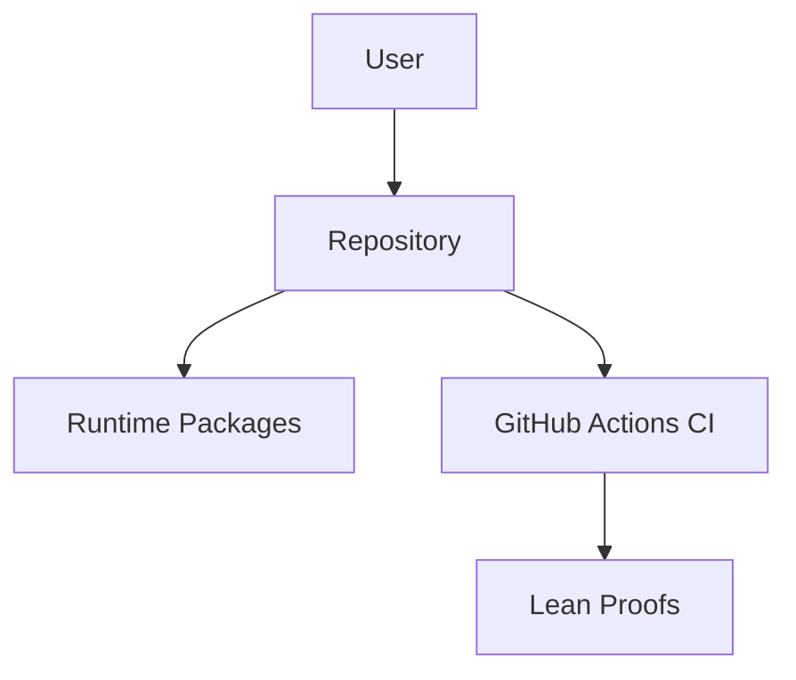
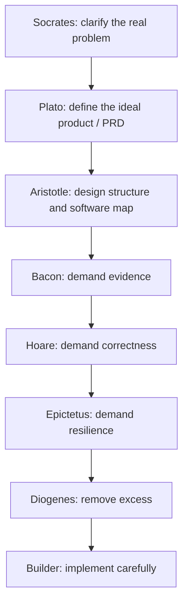
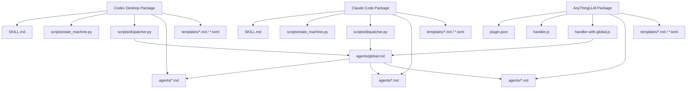
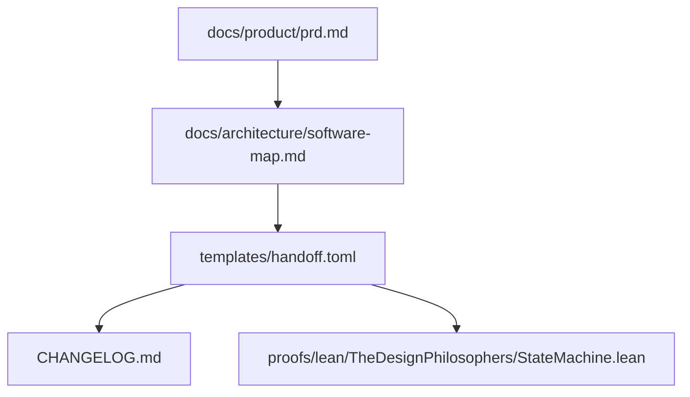
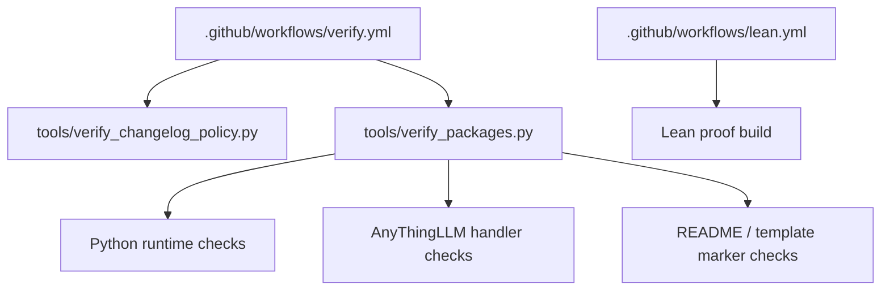

# Software Map

This map shows how the repository's runtime packages, agent prompts, handoff artifacts, verifiers, workflows, and proof models fit together.

The software map is an Aristotle-owned architecture artifact. Plato defines the PRD-level product shape; Aristotle turns that into structure and updates this map before architecture is treated as complete.

## System Context

## Philosopher Stack

## Runtime Package Map

## Artifact Map

## Verification Map

## Ownership Rules

- Socrates owns problem clarity.
- Plato owns the PRD-level Markdown artifact.
- Aristotle owns this software map and the architecture structure it describes.
- Bacon owns evidence and validation obligations for the map.
- Hoare owns correctness and contract consistency for the map.
- Epictetus owns operational failure and recovery concerns in the map.
- Diogenes owns reduction of unnecessary boxes, arrows, abstractions, and fake components.
- Builder implements only after the map survives the pre-build review stack.

## Maintenance Rules

- Update this file when runtime package boundaries, handoff artifact structure, verifier flow, workflow structure, or proof-model integration changes.
- Do not add speculative boxes. Every box should correspond to a real file, package, artifact, or verified workflow concern.
- Prefer Mermaid source in this Markdown file over checked-in generated images.
- If rendered images are needed, place them under `docs/architecture/assets/`.
